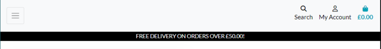
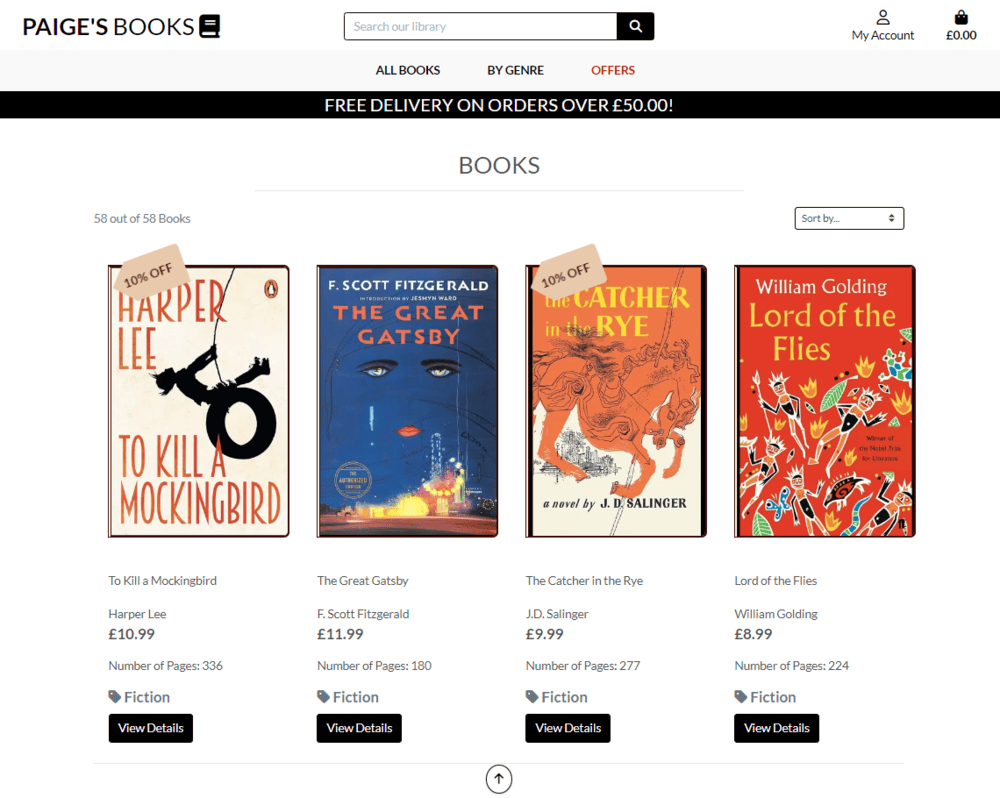

# Paige Turner's Books Shop

## Project Goals

### Overview

### Goals

## User Experience Design

### Strategy Design

#### User Requirements and Expectations

#### User Stories and Epics

##### Epic: Viewing and Navigation

- [1](https://github.com/paddyw11/paiges-books/issues/1) - As a user, I want to browse through different categories of books to find what interests me.

- [2](https://github.com/paddyw11/paiges-books/issues/2) - As a user, I want to see a list of offers on the homepage

- [3](https://github.com/paddyw11/paiges-books/issues/3) - As a user, I want to be able to view detailed information about a specific book, including its description, author, price and category.

- [4](https://github.com/paddyw11/paiges-books/issues/4) - As a user, I want to be able to navigate easily between different pages of the website using a main navigation menu.

##### Epic: Registration and User Accounts

- [5](https://github.com/paddyw11/paiges-books/issues/5) - As a user, I want to register for an account so that I can save my favourite books and manage my orders.

- [6](https://github.com/paddyw11/paiges-books/issues/6) - As a registered user, I want to be able to log in to my account using my email address/username and password.

- [7](https://github.com/paddyw11/paiges-books/issues/7) - As a registered user, I want the option to reset my password if I forget it.

- [8](https://github.com/paddyw11/paiges-books/issues/8) - As a registered user, I want to update my account information such as my shipping address or payment details.

##### Epic: Sorting and Searching

- [9](https://github.com/paddyw11/paiges-books/issues/9) - As a user, I want to be able to sort books by with filters such as price, author, or genre/category.

- [10](https://github.com/paddyw11/paiges-books/issues/10) - As a user, I want to see search results displayed in a clear and organised manner, with relevant book information. 

##### Epic: Puchasing and Checkout

- [11](https://github.com/paddyw11/paiges-books/issues/11) - As a user, I want to add books to my shopping cart and view the contents before proceeding to checkout.

- [12](https://github.com/paddyw11/paiges-books/issues/12) - As a user, I want to be able to easily edit the quantity of books in my cart or remove items altogether.

- [13](https://github.com/paddyw11/paiges-books/issues/13) - As a user, I want to enter my payment information securely and complete the checkout process.

- [14](https://github.com/paddyw11/paiges-books/issues/14) - As a user, I want to receive confirmation of my order via email, including details such as order number and payment.

##### Epic: Administration

- [15](https://github.com/paddyw11/paiges-books/issues/15) - As an admin, I want to be able to add new books to the website, including details such as title, author, category and price.

- [16](https://github.com/paddyw11/paiges-books/issues/16) - As an admin, I want to be able to edit existing book listings to update information such as price, availability, or description.

- [17](https://github.com/paddyw11/paiges-books/issues/17) - As an admin, I want to be able to delete books from the website if they are no longer available or in stock.

- [18](https://github.com/paddyw11/paiges-books/issues/18) - As an admin, I want to manage user accounts, including the ability to view user details, reset passwords, and deactivate accounts if necessary.

- [19](https://github.com/paddyw11/paiges-books/issues/19) - As an admin, I want to receive notifications or alerts for new orders placed on the website, including details such as order number and customer information.

 As a ... i want to be able to .... so that i can ...

-   **Viewing and Navigation Features**

    -   __Feature 1 - Consistent Look and Feel__

        The site's navigation bar and footer appear on every page framing the page's content. The fonts and colours are consitent throughtout providing an intuitive experience for the user. The novagation bar is respoonsive with a burger style icon replacing the nav links on smaller screens. 

         <strong>Fig 01-A.  Desktop example</strong>  
        
        
         <strong>Fig 01-B.  Mobile example</strong>  
        
    
    -   __Feature 2 - User Logged in Indicator__

        The user can easily see if they are logged in at any given time. The user icon will be solid when a user is logged in and emplty if not. The text undernaeth the symbol will display 'My Account' is not logged in and the user's username when logged in. 

         <strong>Fig 02-A.  Logged Out</strong>  
        

         <strong>Fig 02-B.  Loggged In</strong>  
        

    -   __Feature 3 - Home Page__

        The home page is dominated with an image and some header text infomrming the user of the site's main purpose with a prominent call to action button. The navigation section contains links for clear procedures.  

         <strong>Fig 03-A.  Home Page</strong>  
        

    -   __Feature 4 - Books Views__

        The books view allow the user to easily scroll through a number of books and allows sorting by several attriburtes including price, genre and author. Using a card feature, each card displays the front cover of each book and includes a few details about each title. A scroll to top button allows the user to return to the start of the list. A pagination feature is inluded to allow users to navigate through a longer list of titles. 

         <strong>Fig-04-A.  All books view</strong>  
        

    -   __Feature 5 - Search, Filer and Sort__

        There are options available to the user on the navigation bar to filter the list of books and allow them to restrict the results to items they are particularly interested in. For example, the user can choose to just see books for a particular genre or just discounted prints using the 'offers' link. The user can also restrict the list of results based on a search term which will attempt to find matches in the book titles, description, genres and authors name.

         <strong>Fig-05-A.  Search by key term</strong>  
        

         <strong>Fig-05-A.  Search by genre</strong>  
        

         <strong>Fig-05-A.  Search by offers </strong>  
        

    -   __Feature 6 - Offers__

        The dedicated page displays all books that have a discount offer applied. Each book will also be marked with a discount in the main list views.    

         <strong>Fig-06-A.  Offers Page</strong>  
        

    -   __Feature 7 - Book Details__

        When a user clicks on a book they are taken to a book detail page. This will display the full details of the book including short description, a full blurb (opened in a modal), the number of pages, the price, the author and the genre(s). The user can add the book to their basket from this view and can also browse 'Similar Books' which displays books in the same genre(s).  

         <strong>Fig-07-A.  Book Detail View</strong>  
        

    -   __Feature 8 - Author Detials__

        Whilst in a book detail view, the user can click one the authors name to     
        reach the author bio page which includes the author's nationalisty and a short bio description. 

         <strong>Fig-08-A.  Author Detail View</strong>  
        

    -   __Feature 9 - Wishlist__

        When viewing a book user's can select a bookmark icon to add the respective book to their wishlist. For a logged in user they can see a wishlist option in the navigation links to take them to their wishlist view. The books added to the wishlist will be retained for a user when they return to their log in. Users can remove the book from the wishlist by clicking the bookmark icon. The icon changes style when books are in, or out of the wishlist.     

         <strong>Fig-09-A.  Wishlist </strong>  
        

    -   __Feature 10 - Error Pages__

        Text    

         <strong>Fig-10-A.  Loggged In</strong>  
        

    -   __Feature 11 - Onscreen Messages__

        Text    

         <strong>Fig-11-A.  Loggged In</strong>  
        

-   **Registration and Role-based Authorisation Related Features**

    -   __Feature 12 - Sign Up, Login and Logout__

        Text    

         <strong>Fig-12-A.  Loggged In</strong>  
        

    -   __Feature 13 - Role Based Actions__

        Text    

         <strong>Fig-13-A.  Loggged In</strong>  
        

    -   __Feature 14 - User Profile__

        Text    

         <strong>Fig-14-A.  Loggged In</strong>  
        

-   **E-commerce related features**

    -   __Feature 15 - Shopping Basket__

        Text    

         <strong>Fig-15-A.  Loggged In</strong>  
        

    -   __Feature 16 - Checkout__

        Text    

         <strong>Fig-16-A.  Loggged In</strong>  
        

    -   __Feature 17 - Order Confirmation and History__

        Text    

         <strong>Fig-17-A.  Loggged In</strong>  
        

-   **Data Admin Features**

    -   __Feature 18 - Book Management__

        Text    

         <strong>Fig-18-A.  Loggged In</strong>  
        

    -   __Feature 19 - Author Management__

        Text    

         <strong>Fig-19-A.  Loggged In</strong>  
        

### Structure Plane

#### Website Structure - Wireframes

Home Page

Author Bio Page

Book Management

Sign Up

Checkout

Offers

Basket

books

Book Detail

#### Database Design
---

I adopted a crows foot ER design to portray the relationship between each table and it's respective fields. 

## Technologies Used

### Languages Used 

-   [HTML5](https://en.wikipedia.org/wiki/HTML5)
-   [CSS3](https://en.wikipedia.org/wiki/Cascading_Style_Sheets)
-   [Jquery](https://jquery.com/) 
-   [Python](https://www.python.org/)

### Frameworks, Libraries & Programs Used  

-   [Google Fonts:](https://fonts.google.com/) used for the Lato and Old Standard TT fonts.
-   [Font Awesome:](https://fontawesome.com/) was used to add icons for aesthetic and UX purposes.
-   [Bootstrap](https://getbootstrap.com/) was used to build responsive web page
-   [Git:](https://git-scm.com/) was used for version control by utilising the Gitpod terminal to commit to Git and Push to GitHub.
-   [GitHub:](https://github.com/) has been utilied as the respository for the project code after being pushed from Git. In addition, for this project GitHub was used for the agile development aspect through the use of User Stories (GitHub Issues) and tracking their progress on a Kanban board.
-   [Django v4.2](https://www.djangoproject.com/) was used as the framework to support rapid and secure development of the application.
s
-   [Django allauth](https://django-allauth.readthedocs.io/en/latest/index.html) used for account registration and authentication.
-   [Pillow](https://pillow.readthedocs.io/en/stable/index.html) - Python Imaging Library used for image handling
-   [jquery library](https://code.jquery.com/jquery-3.4.1.min.js) - for various pieces of functionality including adding and removing items from the shopping cart and handling the increment and decrement of the quantity control.
-   [Django crispy forms](https://django-crispy-forms.readthedocs.io/en/latest/) used to simplify form rendering.
-   [Stripe](https://js.stripe.com/v3/) used for secure payments (referenced in base.html).
-   [Django Countries](https://pypi.org/project/django-countries/) used on checkout page to pass valid country code to Stripe.
-   [Gunicorn](https://gunicorn.org/) was used as the Web Server to run Django on Heroku.
-   [psycopg2](https://pypi.org/project/psycopg2/) database adapter used to support the connection to the postgres db.
-   [Amazon S3](https://aws.amazon.com/s3/) used to store static files and images.
-   [Boto3](https://pypi.org/project/boto3/) the Amazon Web Services (AWS) Software Development Kit (SDK) for Python.
-   [django_storages](https://django-storages.readthedocs.io/en/latest/) used to connect django to S3.
-   [Heroku](https://www.heroku.com) - used to host the deployed application.
-   [Balsamiq:](https://balsamiq.com/) was used to create the wireframes during the design process.
-   [LucidChart](https://www.lucidchart.com/pages/?) was used to create the Entity Relationship diagrams for the application data model

## Testing

For More information on testing [see here](https://github.com/paddyw11/paigesbooks/blob/main/TESTING.md)

## Bugs

### Search query field error

---

Once I had creatd a new table for genre, in order to make it a manyToMany relationshipe i hadn't updated the search query to reflect that. I needed to update to correct syntax.

### HTML Validation Error on allauth password validator form

---

---

---

I was receiving a W3C validation error on this due to the django password validator and crispy_forms displaying the password vlaidation hints as a list within a small element. 
I attempted to create the form using crispy fields for the other fields and custom design the password1 field. 
I decided it was a better UX to leave the whole form as a crispy fomr in the end. 

## Credits: 

[Image](https://pixabay.com/photos/people-woman-coffee-cafe-couch-1421097/) by [Yerson Retamal](https://pixabay.com/users/voltamax-60363/?utm_source=link-attribution&utm_medium=referral&utm_campaign=image&utm_content=1421097) from [Pixabay](https://pixabay.com//?utm_source=link-attribution&utm_medium=referral&utm_campaign=image&utm_content=1421097)