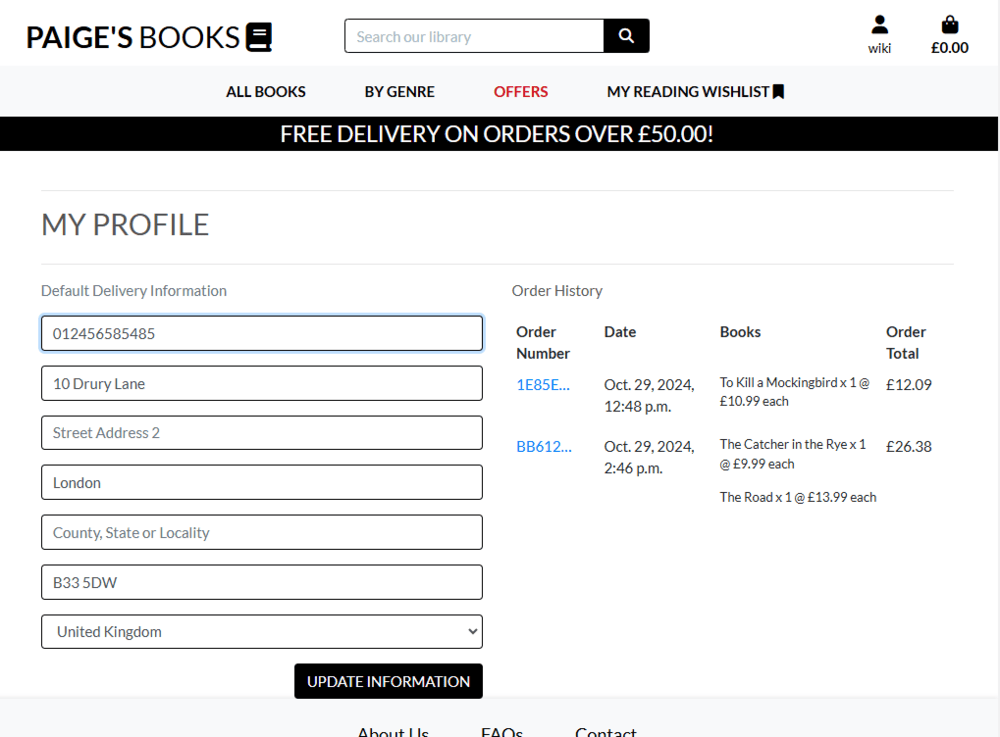

# Paige Turner's Books Shop


The live site can be accessed [here](https://paiges-books-9655906010a2.herokuapp.com/).

## Project Goals

### MosCoW Prioritisation

Must Haves:
1. User account
    - Registration/login (email username and password)
    - User Profile with order history and personal details
2. Book Catalogue
    - Book listing with genres
    - Filters and sorting (e.g price, genre, author)
    - Book details (title, author, price, cover image, blurb)
3. Shopping Basket
    - Add to basket, view basket contents
    - Adjust quantities, remove books from basket
    - Display total price with shipping
4. Checkput Process
    - Secure payment vehicle
    - BIlling and delivery information
    - Order summary with confirmation
5. Search Functionality
    - Keyword Search
    - Advanced search (including genre, author, title)
6. Responsive Design
    - Optimised for mobile, tablet and desktop

Should Haves:
1. Wishlist / Save for Later
    - Allows users to save books for later purchase
2. Reccommendations and Related Books
    - Displays related books based on a genre or by same author.
3. Discounts and Promotions
    - Display banner for special offers or discounts
    - Show which books are included in offer or discount

Could Haves
1. Book Sample View
    - Display a sample of the book to users.
2. User Customisation
    - Allows users to set preferences for genres or authors.
3. Mailing List
    - Users can sign up for new release/offers emails.
4. Reader reviews
    - Users are able to leave reviews on books they've read. 


## User Experience Design

### Strategy Design

#### User Stories and Epics

##### Epic: Viewing and Navigation

- 1.1 - As a user, I want to browse through different categories of books to find what interests me.

- 1.2 - As a user, I want to see a list of offers on the homepage

- 1.3 - As a user, I want to be able to view detailed information about a specific book, including its description, author, price and category.

- 1.4 - As a user, I want to be able to navigate easily between different pages of the website using a main navigation menu.

##### Epic: Registration and User Accounts

- 2.1- As a user, I want to register for an account so that I can save my favourite books and manage my orders.

- 2.2- As a registered user, I want to be able to log in to my account using my email address/username and password.

- 2.3- As a registered user, I want the option to reset my password if I forget it.

- 2.4- As a registered user, I want to update my account information such as my shipping address or payment details.

##### Epic: Sorting and Searching

- 3.1- As a user, I want to be able to sort books by with filters such as price, author, or genre/category.

- 3.2 - As a user, I want to see search results displayed in a clear and organised manner, with relevant book information.

- 3.3 - As a user, I want to be able to save a list of books that i wish to purchase/read. 

##### Epic: Puchasing and Checkout

- 4.1 - As a user, I want to add books to my shopping cart and view the contents before proceeding to checkout.

- 4.2 - As a user, I want to be able to easily edit the quantity of books in my cart or remove items altogether.

- 4.3 - As a user, I want to enter my payment information securely and complete the checkout process.

- 4.4 - As a user, I want to receive confirmation of my order via email, including details such as order number and payment.

- 4.5 -  As a user, i want to be able to view my order history.

##### Epic: Administration

- 5.1 - As an admin, I want to be able to add new books to the website, including details such as title, author, category and price.

- 5.2 - As an admin, I want to be able to edit existing book listings to update information such as title, author, category and price.

- 5.3 - As an admin, I want to be able to delete books from the website if they are no longer available or in stock.

- 5.4 - As an admin, I want to be able to add new authors to the website, including details such as name, nationailty and a short bio.

- 5.5 - As an admin, I want to be able to edit existing author listings to update information.

- 5.6 - As an admin, I want to be able to delete authors from the website.

### Features

-   **Viewing and Navigation Features**

    -   __Feature 1 - Consistent Look and Feel__

        The site's navigation bar and footer appear on every page framing the page's content. The fonts and colours are consitent throughtout providing an intuitive experience for the user. The novagation bar is respoonsive with a burger style icon replacing the nav links on smaller screens. 

        <br><strong>Fig 01-A.  Desktop example</strong><br><br>
        
        
        <br><strong>Fig 01-B.  Mobile example</strong><br><br>
        
    
    -   __Feature 2 - User Logged in Indicator__

        The user can easily see if they are logged in at any given time. The user icon will be solid when a user is logged in and emplty if not. The text undernaeth the symbol will display 'My Account' is not logged in and the user's username when logged in. 

        <br><strong>Fig 02-A.  Logged Out</strong><br><br>
        

        <br><strong>Fig 02-B.  Logged In</strong><br><br>
        

    -   __Feature 3 - Home Page__

        The home page is dominated with an image and some header text infomrming the user of the site's main purpose with a prominent call to action button. The navigation section contains links for clear procedures.  

        <br><strong>Fig 03-A.  Home Page</strong><br><br>
        

    -   __Feature 4 - Books Views__

        The books view allow the user to easily scroll through a number of books and allows sorting by several attriburtes including price, genre and author. Using a card feature, each card displays the front cover of each book and includes a few details about each title. A scroll to top button allows the user to return to the start of the list. A pagination feature is inluded to allow users to navigate through a longer list of titles. 

        <br><strong>Fig-04-A.  All books view</strong><br><br>
        

    -   __Feature 5 - Search, Filer and Sort__

        There are options available to the user on the navigation bar to filter the list of books and allow them to restrict the results to items they are particularly interested in. For example, the user can choose to just see books for a particular genre or just discounted prints using the 'offers' link. The user can also restrict the list of results based on a search term which will attempt to find matches in the book titles, description, genres and authors name.

        <br><strong>Fig-05-A.  Search by key term</strong><br><br>
        

        <br><strong>Fig-05-A.  Search by genre</strong><br><br>
        

        <br><strong>Fig-05-A.  Search by offers </strong><br><br>
        

    -   __Feature 6 - Offers__

        The dedicated page displays all books that have a discount offer applied. Each book will also be marked with a discount in the main list views.    

        <br><strong>Fig-06-A.  Offers Page</strong><br><br>
        

    -   __Feature 7 - Book Details__

        When a user clicks on a book they are taken to a book detail page. This will display the full details of the book including short description, a full blurb (opened in a modal), the number of pages, the price, the author and the genre(s). The user can add the book to their basket from this view and can also browse 'Similar Books' which displays books in the same genre(s).  

        <br><strong>Fig-07-A.  Book Detail View</strong><br><br>
        

    -   __Feature 8 - Author Detials__

        Whilst in a book detail view, the user can click one the authors name to     
        reach the author bio page which includes the author's nationalisty and a short bio description. 

        <br><strong>Fig-08-A.  Author Detail View</strong><br><br>
        

    -   __Feature 9 - Wishlist__

        When viewing a book user's can select a bookmark icon to add the respective book to their wishlist. For a logged in user they can see a wishlist option in the navigation links to take them to their wishlist view. The books added to the wishlist will be retained for a user when they return to their log in. Users can remove the book from the wishlist by clicking the bookmark icon. The icon changes style when books are in, or out of the wishlist.     

        <br><strong>Fig-09-A.  Book can be added to the wishlist from the book detail page.</strong><br><br>
        

        <br><strong>Fig-09-B. Books added to the wishlist can be viewd on the wishlist page.</strong><br><br>
        

    -   __Feature 10 - Error Pages__

        The site has custom error pages to give a better user experience.     

        <br><strong>Fig-10-A.  404 Error Page</strong><br><br>
        

    -   __Feature 11 - Onscreen Messages__

        Users can be notified of certain actions with on-screen messages. They can receive messages for actions such as successful logging in, logging out, adding a book to the basket and a successful checkout. 

        <br><strong>Fig-11-A.  Logged In</strong><br><br>
        

        <br><strong>Fig-11-B.  Logged Out</strong><br><br>
        

        <br><strong>Fig-11-C.  Added to Basket</strong><br><br>
        

        <br><strong>Fig-11-D.  Order Success</strong><br><br>
        

-   **Registration and Role-based Authorisation Related Features**

    -   __Feature 12 - Sign Up, Login and Logout__

        Users can register for the site by following the register link and completing the sign up form. Once they have registred they can log in to their profile, and save reading lsits and order history as necessary. 

        <br><strong>Fig-12-A. Sign Up Form</strong><br><br>
        

        <br><strong>Fig-12-B. Log In</strong><br><br>
        

        <br><strong>Fig-12-C. Log Out</strong><br><br>
        

    -   __Feature 13 - Role Based Actions__

        Role based actions allow users access to certain features or action based on their role type. Any logged in user has access to the wishlist page. Logged in admin users have several features to create new books or authors, edit existing ones or delete information. The addtional features are available to users under the profile icon. 
        
        <br><strong>Fig-13-A.  Loggged In User</strong><br><br>
        

        <br><strong>Fig-13-B.  Loggged In Admin</strong><br><br>
        


    -   __Feature 14 - User Profile__

        Logged in users can click to save delivery details to their profile when completing an order. These details will be retained in the user's profile page and will pre-populate data-fields in subsequent checkout pages. 

        <br><strong>Fig-14-A.  Profile Page</strong><br><br>
        

        <br><strong>Fig-14-B.  Pre-filled Checkout Page</strong><br><br>
        

-   **E-commerce related features**

    -   __Feature 15 - Shopping Basket__

        Users can add books they intend to puchase in the shopping basket page. Users can continue shopping and their books will be retained in the basket until they are ready to complete the checkout.     

        <br><strong>Fig-15-A.  Shopping Basket</strong><br><br>
        

    -   __Feature 16 - Checkout__

        When the user is ready to complete their purchase they can navigate to the checkout page and enter the delivery details and billing details. If they have saved their personal detials the form will be pre-populated (see Feature 14).
        Payments are securely handled by Stripe's widgets in the site. Webhooks are used to ensure that transactions are handled correctly in the case of any problems encountered during payment processing.

        <br><strong>Fig-16-A.  Checkout</strong><br><br>
        

    -   __Feature 17 - Order Confirmation and History__

        Once an order is sucessfully complete users are taken to tne order confimtiaon page which details the items ordered and the delivery address. Logged in users can see their order history. 

        <br><strong>Fig-17-A.  Order Confirmation Page</strong><br><br>
        

        <br><strong>Fig-17-B.  Order History</strong><br><br>
        


-   **Data Admin Features**

    -   __Feature 18 - Book Management__

        Logged in admin users can add new books to the book shop. They are also able to edit and delte existing books in the shop.     

        <br><strong>Fig-18-A.  Add a book</strong><br><br>
        


        <br><strong>Fig-18-A.  Edit a book</strong><br><br>
        


    -   __Feature 19 - Author Management__

        Logged in admin users can manage authors by accessing the author admin area through their menu options link. They are able to add a new author and add their bio information. Admins can also edit or delete an existing author from the shop.     

        <br><strong>Fig-19-A.  Add an author</strong><br><br>
        

        <br><strong>Fig-19-A.  Edit an author</strong><br><br>
        


### Structure Plane

#### Website Structure - Wireframes

<details>
<summary>Home Page</summary>


</details>

<details>
<summary>Author Bio Page</summary>


</details>

<details>
<summary>Book Management</summary>


</details>

<details>
<summary>Sign Up</summary>


</details>

<details>
<summary>Checkout</summary>


</details>

<details>
<summary>Offers</summary>


</details>

<details>
<summary>Basket</summary>


</details>

<details>
<summary>books</summary>


</details>

<details>
<summary>Book Detail</summary>


</details>


#### Database Design
---

I adopted a crows foot ER design to portray the relationship between each table and it's respective fields. 


## Technologies Used

### Languages Used 

-   [HTML5](https://en.wikipedia.org/wiki/HTML5)
-   [CSS3](https://en.wikipedia.org/wiki/Cascading_Style_Sheets)
-   [Jquery](https://jquery.com/) 
-   [Python](https://www.python.org/)

### Frameworks, Libraries & Programs Used  

-   [Google Fonts:](https://fonts.google.com/) used for the Lato and Old Standard TT fonts.
-   [Font Awesome:](https://fontawesome.com/) was used to add icons for aesthetic and UX purposes.
-   [Bootstrap](https://getbootstrap.com/) was used to build responsive web page
-   [Git:](https://git-scm.com/) was used for version control by utilising the Gitpod terminal to commit to Git and Push to GitHub.
-   [GitHub:](https://github.com/) has been utilied as the respository for the project code after being pushed from Git. In addition, for this project GitHub was used for the agile development aspect through the use of User Stories (GitHub Issues) and tracking their progress on a Kanban board.
-   [Django v4.2](https://www.djangoproject.com/) was used as the framework to support rapid and secure development of the application.
s
-   [Django allauth](https://django-allauth.readthedocs.io/en/latest/index.html) used for account registration and authentication.
-   [Pillow](https://pillow.readthedocs.io/en/stable/index.html) - Python Imaging Library used for image handling
-   [jquery library](https://code.jquery.com/jquery-3.4.1.min.js) - for various pieces of functionality including adding and removing items from the shopping cart and handling the increment and decrement of the quantity control.
-   [Django crispy forms](https://django-crispy-forms.readthedocs.io/en/latest/) used to simplify form rendering.
-   [Stripe](https://js.stripe.com/v3/) used for secure payments (referenced in base.html).
-   [Django Countries](https://pypi.org/project/django-countries/) used on checkout page to pass valid country code to Stripe.
-   [Gunicorn](https://gunicorn.org/) was used as the Web Server to run Django on Heroku.
-   [psycopg2](https://pypi.org/project/psycopg2/) database adapter used to support the connection to the postgres db.
-   [Amazon S3](https://aws.amazon.com/s3/) used to store static files and images.
-   [Boto3](https://pypi.org/project/boto3/) the Amazon Web Services (AWS) Software Development Kit (SDK) for Python.
-   [django_storages](https://django-storages.readthedocs.io/en/latest/) used to connect django to S3.
-   [Heroku](https://www.heroku.com) - used to host the deployed application.
-   [Balsamiq:](https://balsamiq.com/) was used to create the wireframes during the design process.
-   [LucidChart](https://www.lucidchart.com/pages/?) was used to create the Entity Relationship diagrams for the application data model


## Testing

For More information on testing [see here](https://github.com/paddyw11/paigesbooks/blob/main/TESTING.md)

## Bugs

### Search query field error

---


Once I had creatd a new table for genre, in order to make it a manyToMany relationshipe i hadn't updated the search query to reflect that. I needed to update to correct syntax.

### HTML Validation Error on allauth password validator form

---


---


---

I was receiving a W3C validation error on this due to the django password validator and crispy_forms displaying the password vlaidation hints as a list within a small element. 
I attempted to create the form using crispy fields for the other fields and custom design the password1 field. 
I decided it was a better UX to leave the whole form as a crispy form in the end. 

## Deployment
### Cloning and Forking
#### Fork

1. On Github.com, navigate to the Paige's Books repositry [here](https://github.com/paddyw11/paiges-books)
2. In the top right hand corner click on 'Fork'.
3. By defualt, forksare named the same as their parent repository. You can change the name of the fork to distinguish it. 
4. Add a description of your fork.
5. Click 'Create Fork'.

#### How to clone this site

1. Log into GitHub or set up a new account.
2. Navigate to the repository [here](https://github.com/paddyw11/paiges-books)
3. Click on the code button, select whether to clone with HTTPS, SSH or GitHub CLI and copy the link shown.
4. Open a terminal in a new IDE workspace where you wish to clone the repository to.
5. Type 'git clone' into the terminal and paste the link copied from the original source repository and press the Enter key to begin the clone process.

#### How to create a PostgreSQL database

1. Go to this [page](https://bds.ci-dbs.net/)
2. Type in your email address.
3. Follow the link in the email.
4. Make a note of your database URL


### Local Deployment 


### Deploying to Heroku

1. Create an account on Heroku and log in. 
2. Create a new app and navigate to 'settings'.
3. Click 'Reveal config variables'.
4. Add a new variable with the key: `DATABASE_URL` with the value being the noted url from PostgreSQL.
5. In the IDE go to your main app's settings file and add the heroku app name to the allowed hosts. Be sure to append `.herokuapp.com` to your app's name. 
6. Add EMAIL_HOST_PASSWORD and the value as the password for the email service.
In the Gitpod terminal, install  `pip3 install dj_database_url==2.2.0 psycopg2`
7. In the Gitpod terminal, run `pip freeze > requirements.txt`
8. In the settings.py file, type in `import dj_database_url` under `import os`
9. In the DATABASES section of the settings.py file, insert the following code: 
```python
DATABASES = {
     'default': dj_database_url.parse('your-database-url-here')
 }
 ```
 10. Do not commit with the database string in the code
 11. In the terminal, run `python3 manage.py showmigrations` to confirm DB is connected
 12. Add the following if statement to the settings.py:
 ```python
    if "DATABASE_URL" in os.environ:
        DATABASES = {
            'default': dj_database_url.parse(os.environ.get('DATABASE_URL'))
        }
    else:
        DATABASES = {
            "default": {
                "ENGINE": "django.db.backends.sqlite3",
                "NAME": os.path.join(BASE_DIR, "db.sqlite3"),
            }
        }
```
13. In the terminal, type in `pip3 install gunicorn==23.0.0`
14. In the terminal, run `pip freeze > requirements.txt`
15. Create a Procfile
16. In the Procfile, type in `web gunicorn paiges_books.wsgi:application`
17. In the terminal, type in `heroku config:set DISABLE_COLLECTSTATIC=1`
18. Add the Heroku app URL to 'allowed hosts' in settings.py
19. Commit and push
20. In the terminal, type in `git push heroku main`
21. Create a secret key and add to CONFIG VARS in heroku

### Creating a AWS bucket

1. Create an AWS account [here](https://aws.amazon.com/)
2. Go to S3
3. Ceate a bucket with the name matching the Heroku app and uncheck 'block all public access'
4. Go to the properties tab and turn on static website hosting
5. In the permissions tab, go to Policies
6. Go to Policy Generator
7. Select Policy Type as 'S3 bucket policy' and generate
8. Copy the ARN and paste into the box
9. Copy the generated policy and paste into Bucket Policy section
10. In the Cors configuration, type
```python
[
{
"AllowedHeaders": [
"Authorization"
],
"AllowedMethods": [
"GET"
],
"AllowedOrigins": [
"*"
],
"ExposeHeaders": []
}
]
```
11. Open IAM
12. Click Groups and create a new group for managing your app
13. Click Policies and then Create Policy
14. Go to JSON tab and click Import policy
15. Import the S3 Full Access Policy
16. Get the Bucket ARN from S3 and paste into the 'Resource' section
17. Skip Tabs and click Review Policy, give it a name and descripcion, click Create Policy
18. Attach the Policy to the group you created
19. Go to the Users page and click Create User
20. Create a new user for the static files
21. Add the user to your group
22. Download the CSV file to get your secret keys

### Creating a AWS bucket

1. Create an AWS account [here](https://aws.amazon.com/)
2. Go to S3
3. Ceate a bucket with the name matching the Heroku app and uncheck 'block all public access'
4. Go to the properties tab and turn on static website hosting
5. In the permissions tab, go to Policies
6. Go to Policy Generator
7. Select Policy Type as 's3 bucket policy' and generate
8. Copy the ARN and paste into the box
9. Copy the generated policy and paste into Bucket Policy section
10. In the Cors configuration, type
```python
[
{
"AllowedHeaders": [
"Authorization"
],
"AllowedMethods": [
"GET"
],
"AllowedOrigins": [
"*"
],
"ExposeHeaders": []
}
]
```
11. Open IAM
12. Click Groups and create a new group for managing your app
13. Click Policies and then Create Policy
14. Go to JSON tab and clixk Import policy
15. Import the S3 Full Access Policy
16. Get the Bucket ARN from S3 and paste into the 'Resource' section
17. Skip Tabs and click Review Policy, give it a name and descripcion, click Create Policy
18. Attach the Policy to the group you created
19. Go to the Users page and click Create Uer
20. Create a new user for the static files
21. Add the user to your group
22. Download the CSV file to get your secret keys

### Connecting AWS and Django

1. In your terminal, type in `pip3 install boto3`
2. In the terminal, type in `pip3 install django-storages`
3. In the terminal, run `pip freeze > requirements.txt`
4. Add 'storages' in Installed Apps in settings.py
5. In settings. py, add the following if statement:
```python
if "USE_AWS" in os.environ:

    AWS_STORAGE_BUCKET_NAME = "paiges-books"
    AWS_S3_REGION_NAME = "eu-north-1"
    AWS_ACCESS_KEY_ID = os.environ.get("AWS_ACCESS_KEY_ID")
    AWS_SECRET_ACCESS_KEY = os.environ.get("AWS_SECRET_ACCESS_KEY")
    AWS_S3_CUSTOM_DOMAIN = f"{AWS_STORAGE_BUCKET_NAME}.S3.amazonaws.com"
```
6. Add your AWS keys to Config Vars in Heroku
7. Create a file called custom_storages.py
8. In the file, type in:
```python
from django.conf import settings
from storages.backends.s3boto3 import S3Boto3Storage

class StaticStorage(S3Boto3Storage):
    location = settings.STATICFILES_LOCATION

class MediaStorage(S3Boto3Storage):
    location = settings.MEDIAFILES_LOCATION
```
9. In the settings.py, add:
```python

    STATICFILES_STORAGE = "custom_storages.StaticStorage"
    STATICFILES_LOCATION = "static"
    DEFAULT_FILE_STORAGE = "custom_storages.MediaStorage"
    MEDIAFILES_LOCATION = "media"


    STATIC_URL = f"https://{AWS_S3_CUSTOM_DOMAIN}/{STATICFILES_LOCATION}/"
    MEDIA_URL = f"https://{AWS_S3_CUSTOM_DOMAIN}/{MEDIAFILES_LOCATION}/"
```
10. Commit and push your changes
11. In your if statement, add the following code:
```python
if "USE_AWS" in os.environ:
    # Cache Control
    AWS_S3_OBJECT_PARAMETERS = {
        "Expires": "Thu, 31 Dec 2099 20:00:00 GMT",
        "CacheControl": "max-age=94608000",
    }
```
12. Commit and push
13. Create MEDIA folder and S3 and add your media files
14. Grant public access to your files and upload
15. Add STRIPE keys to Heroku Config Vars
16. Create a new Webhook on Stripe linked to your Heroku App
17. Add Webhook signing secret to Heroku Config Vars


## Credits: 

I have used the Code Iinstitute community [Slack](https://slack.com/intl/en-gb) channel for useful hints and tips.

Index Page Image [source](https://pixabay.com/photos/book-pages-open-book-read-reading-1868068/) by [Pexels](https://pixabay.com/users/pexels-2286921/) 

About Us Page Image [source](https://www.pexels.com/photo/woman-in-brown-suede-peacoat-reading-a-book-762080/) by [Andrea Piacquadio](https://www.pexels.com/@olly/)

Book Cover Images [Amazon](https://www.amazon.co.uk/)

Book Blurb and Author Bio Text written by ChatGPT-4o from [OpenAi](https://openai.com/)

## Acknowledgements

I would like to thank the following:

- My Mentor Daniel Hamilton for gis helpful insights. 
- Friends and relative for their testing. 